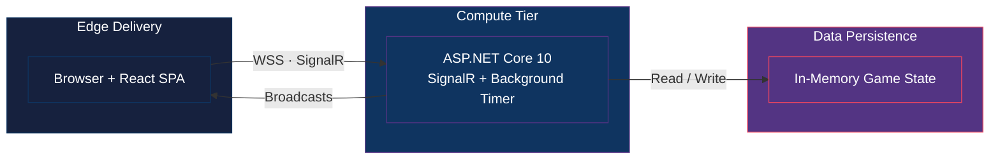
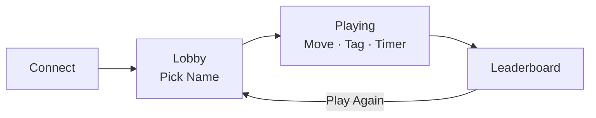
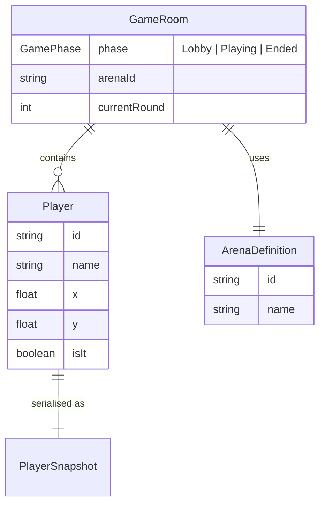

# PoTagGame

Real-time multiplayer tag game built with ASP.NET Core 10, SignalR, React 18, and Canvas 2D. Players join a lobby, pick names, and chase each other across themed arenas — the server is the single source of truth for all game state and collision detection.

## Architecture Overview



| Layer | Tech |
|-------|------|
| **Client** | React 18 · TypeScript 5.4 · Vite 5 · Tailwind CSS 3.4 · Canvas 2D |
| **Real-time** | SignalR 9 (WebSocket with auto-reconnect) |
| **Server** | ASP.NET Core 10 · Minimal API · Serilog |
| **Deploy** | Azure App Service (serves client + API) |

## Game Flow



**Lobby** → anonymous join, 1–8 players, auto-start countdown at 2+ players  
**Playing** → 40s rounds, random IT assignment, 40px tag radius, 2s post-tag immunity  
**End** → best-of-3 rounds, leaderboard sorted by least time as IT

## Project Structure

```
src/
├── client/             React SPA (Vite + TypeScript)
│   └── src/
│       ├── engine/     AnimationController · InputHandler · SpriteLoader
│       ├── features/   connection/ · game/ · lobby/
│       ├── components/ Button · ConnectionBadge · InvitePanel
│       ├── constants/  arenas · sprites
│       └── types/      game.ts
├── server/             ASP.NET Core 10
│   ├── Domain/         GameRoom · Player · GameService · TagChecker · ReplayRecorder
│   ├── Features/       Game/ · Lobby/ · Position/ · Replay/
│   └── Infrastructure/ Hubs/TagHub · BackgroundServices/GameBackgroundService
├── shared/             arenas.json (shared arena definitions)
└── tests/
    ├── TagGame.Tests.Unit/
    ├── TagGame.Tests.Integration/
    └── TagGame.Tests.E2E/         Playwright
sprites/                           Sprite sheets (4 animations × 4 directions)
docs/                              Architecture diagrams (Mermaid)
```

## Quick Start

```bash
# Optional: local Azurite container (required for storage integration tests)
docker compose -f docker-compose.azurite.yml up -d

# Server (terminal 1)
dotnet watch run --project src/server/PoTagGame.csproj --launch-profile http

# Client (terminal 2)
cd src/client && npm install && npm run dev
```

Open `http://localhost:5173` — the Vite dev server proxies SignalR to the .NET backend.

Health and diagnostics endpoints:

- `http://localhost:5000/health` returns structured JSON health for configured dependencies.
- `http://localhost:5000/diag` returns masked connection info plus dependency status.

## Documentation

All architecture diagrams live in `/docs/` as `.mmd` (Mermaid) files. Each has a `_SIMPLE` variant for quick stakeholder review.

| Diagram | Description | File |
|---------|-------------|------|
| **Architecture** | C4 Level 1+2 — Edge, Compute, Data tiers | [Architecture_MASTER.mmd](docs/Architecture_MASTER.mmd) |
| **Data Lifecycle** | Input → Server Processing → UI Render pipeline | [DataLifecycle_MASTER.mmd](docs/DataLifecycle_MASTER.mmd) |
| **Data Model** | ERD — GameRoom, Player, Arena, Replay entities | [DataModel.mmd](docs/DataModel.mmd) |
| **System Flow** | User journey — Connect → Lobby → Play → End | [SystemFlow_MASTER.mmd](docs/SystemFlow_MASTER.mmd) |
| **Multiplayer Flow** | Sequence diagram — SignalR messages, tags, sync | [MultiplayerFlow.mmd](docs/MultiplayerFlow.mmd) |

**Simplified variants:** Each diagram has a `_SIMPLE.mmd` companion (e.g., [Architecture_SIMPLE.mmd](docs/Architecture_SIMPLE.mmd)) with only top-level nodes.

**Screenshots:** Visual assets go in [docs/screenshots/](docs/screenshots/).

## Domain Model



## SignalR Messages

| Direction | Method | When |
|-----------|--------|------|
| Client → Server | `JoinLobby(name)` | User joins |
| Client → Server | `StartGame(arenaId)` | Game begins |
| Client → Server | `UpdatePosition(x, y, state, dir)` | Every 50ms |
| Server → Client | `Joined` / `LobbyUpdated` | Lobby roster changes |
| Server → Client | `GameStarted` / `StateUpdated` | Game state sync |
| Server → Client | `TimeTick` | 1 Hz countdown |
| Server → Client | `RoundEnded` / `GameEnded` | Round/session complete |

## Arenas

| Arena | Description |
|-------|-------------|
| **Grassland** | Open field, no walls |
| **Dungeon** | Maze-like corridors |
| **Rooftop** | Elevated platforms |

## Testing

```bash
# Unit tests
dotnet test src/tests/TagGame.Tests.Unit

# Integration tests
dotnet test src/tests/TagGame.Tests.Integration

# E2E (Playwright)
cd src/tests/TagGame.Tests.E2E && npx playwright test
```

## License

Private — all rights reserved.
